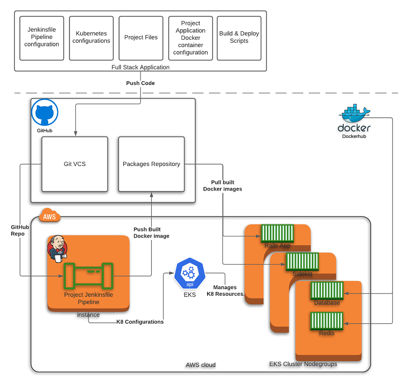

# A CI/CD Project for a Rails + Sidekiq + PostGres application.

# Description
This project stack was originally created for the "Udacity: Cloud DevOps Engineer" Capstone Project.
This stack captures the application, as well as, the infrastructure as code per DevOps principles. In short, this
project, with the help of Jenkins, will lint, build, publish, and deploy a Rails, Sidekiq, Redis, and Postgres environment.

I use docker as the container format for the building and containing the Rails + Sidekiq application. I use the AWS Elastic Kubernetes Service (EKS)
as the container orchestration service to host, manage, and run the application environment. 
 
## Architecture Diagram

# Prerequisites
## Application Development
- Make
- Docker 19.x
- Docker Compose 1.26.x
- `kubectl` v1.17.x 
- `eksctl` v0.27.x
- Ruby 2.7.x
- Rails 5.2.x
- libpg-dev

## Jenkins
### Configuration
- Set up AWS credentials (id: `aws-jenkins`)
- Set up Docker credentials (id: `github-mhutton86`)
- Set up Kubeconfig credentials

### Plugins
- Blue Ocean
- CloudBees Docker Build and Publish plugin
- Kubernetes Continuous Deploy Plugin
- Pipeline: AWS Steps

### Server (Jenkins is running on)
- Docker
- Docker Compose
- Make
- pass 
- gnupg2
- awscli (configuration at ~jenkins/.aws/config & ~jenkins/.aws/credentials)
- kubectl (configuration at ~jenkins/.kube/config)

## Environment
- AWS
    - With the necessary permissions to EKS, CloudFormation, and S3

# Workflows
## Development (Docker)
### First-time Setup
1. Build and run the docker image. Can be called subsequently.
    - `make run-docker-dev-env`
    - _Note: You may require calling this with a sudo. Docker Compose doesn't always run with the same privelidges that Docker does._
1. Provision development data. This only needs to be run once against a fresh environment.
    - `./scripts/docker-provision-dev-env.sh`

### Reset development environment and data
1. Tear down the development environment and scrub the data. This should, NEVER, be run against production.
    - `./scripts/docker-reset-dev-env.sh`

## CI/CD
1. The developer pushes their code to GitHub
1. Jenkins polls GitHub for changes
1. Upon a change, kicks off a build of this at `[Jenkins URL]:[Jenkins Port]/blue/organizations/jenkins/fullstack-build-project/activity`
1. The build goes through the locally defined `Jenkinsfile` to checkout, lint, build, publish (container), and deploy to Kubernetes.
    1. Each build step is dependent on the previous.
    1. Any failure will prevent the remaining steps from execution.

# File Structure (by tech)
- Docker + Compose 
    - Dockerfile: `Dockerfile`
    - docker-compose.yaml: `docker/development/docker-compose.yml`
    - Scripts: `scripts/docker`
- Kubenetes (K8)
    - Configuration files: `docker/kubernetes/*`
    - Scripts: `scripts/k8`
- Jenkins
    - Pipeline definition: `Jenkinsfile`

# References
1. This article was used for creating Rails, Sidekiq, and Postgres environment on docker 
    1. https://dev.to/raphael_jambalos/more-than-hello-world-in-docker-run-rails-sidekiq-web-apps-in-docker-1b37
2. Emphasis was placed on making a "Twelve Factor App"
    1. https://12factor.net/